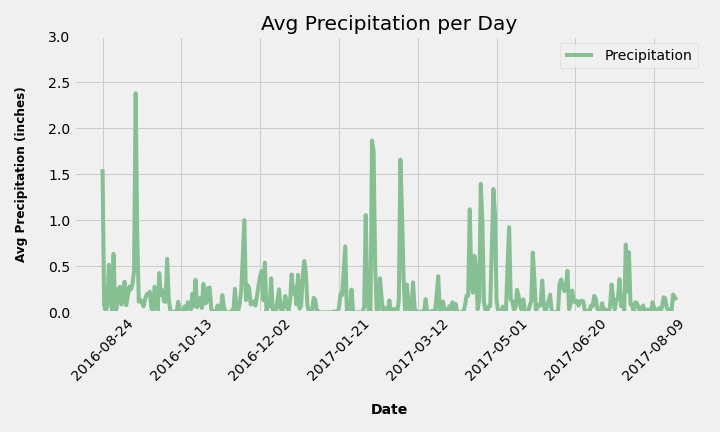
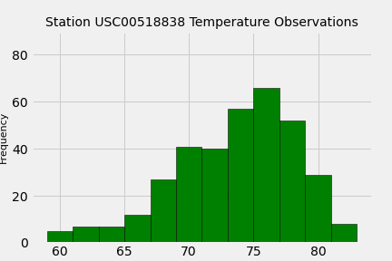

## Surfs Up!

This exercise utlizes Pandas, SQLAlchemy, SQLite, and Flask to analyze weather data in Hawaii.

## Climate Analysis and Exploration

Python, SQLAlchemy, and Matplotlib are used to do basic climate analysis and data exploration of the climate database. 

* The [hawaii.sqlite](Resources/hawaii.sqlite) file is imported into Jupyter Notebook to complete the climate analysis and data exploration.

* SQLAlchemy `create_engine` connects to the sqlite database.

Link to file: https://github.com/danawoodruff/SQLAlchemy-challenge/blob/main/climate_starter.ipynb

### Precipitation Analysis

* From the most recent date in the data set retrieve the last 12 months of precipitation data.

* Query results are loaded into a Pandas DataFrame and sorted by date.

* The results are plotted in Matplotlib.

  

* Pandas is used to generate the summary statistics for the precipitation data.

### Station Analysis

* Query to calculate the total number of stations in the dataset.

* Query to find the most active stations (i.e. which stations have the most rows?).

* Query to retrieve the last 12 months of temperature observation data (TOBS).

  * Filter by the station with the highest number of observations.

  * Plot the results as a histogram.
  
    

## Climate App

A Flask API is designed based on the previous queries.

### Routes

* `/`

  * Home page: List all available routes.

* `/api/v1.0/precipitation`

  * Convert the query results to a dictionary using `date` as the key and `prcp` as the value.

  * Return the JSON representation of your dictionary.

* `/api/v1.0/stations`

  * Return a JSON list of stations from the dataset.

* `/api/v1.0/tobs`
  * Query the dates and temperature observations of the most active station for the last year of data.

  * Return a JSON list of temperature observations (TOBS) for the previous year.

* `/api/v1.0/<start>` and `/api/v1.0/<start>/<end>`

  * Return a JSON list of the minimum temperature, the average temperature, and the max temperature for a given start or start-end range.

  * When given the start only, calculate `TMIN`, `TAVG`, and `TMAX` for all dates greater than and equal to the start date.

  * When given the start and the end date, calculate the `TMIN`, `TAVG`, and `TMAX` for dates between the start and end date inclusive.

## Hints

* You will need to join the station and measurement tables for some of the queries.

* Use Flask `jsonify` to convert your API data into a valid JSON response object.

- - -
### Temperature Analysis I

Hawaii is reputed to enjoy mild weather all year. Is there a meaningful difference between the temperature in, for example, June and December?

Link to file: https://github.com/danawoodruff/SQLAlchemy-challenge/blob/main/temp_analysis.ipynb

* A paired t-test is designed to compare the means of the same group under two separate scenarios. 
 -An unpaired t-test compares the means of two unrelated groups.
 -Presumably the temperatures in the months of June and December are independent(unrelated) of one another.
 -An unpaired test is the more approprite choice.

* The null hypothesis is that there is no statistically significant difference in the mean of June and December temperatures in Hawaii.

* The t-statistic value is 31.6 and the p-value is 3.9e-191 so the null hypothesis is rejected. There is a statistically significant difference between the June and the December mean temperatures in Hawaii. 
